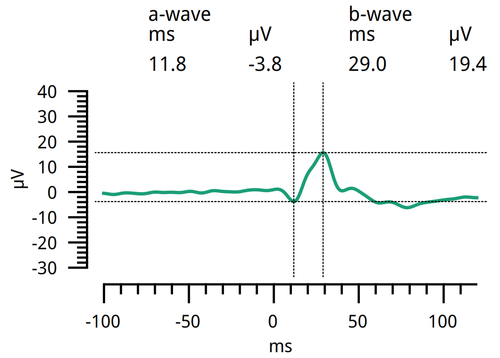

```{r setup, include=FALSE}
knitr::opts_chunk$set(echo = FALSE)
library(tidyverse)
library(magrittr)
library(broom)
library(knitr)
library(readr)
library(ggplot2)
library(stringr)

source('./r-scripts/mung-data.r')
```

## What data I'm using so far
```{r, out.width="600px", warning=FALSE, eval=TRUE, message=FALSE, tidy=TRUE, dev='png', echo=FALSE, fig.show='hold', fig.align='center'}

```

* n = `r data %$% n_distinct(id)`, (`r data %>% filter(group=='patient') %$% n_distinct(id)` with ASD)
* Contains amplitude and latency of the:
    + a-wave (photoreceptors)
    + b-wave (bipolar cells)

## What are the raw values of this data?
```{r  fig.width=10, fig.height=7, warning=FALSE, eval=TRUE, message=FALSE, tidy=TRUE, dev='png', echo=FALSE, fig.show='hold', fig.align='center'}
source('./r-scripts/plot-group-diffs.r', print.eval = TRUE)
```

## How do the different variable relate to each other?

We know that the different waves relate to each other like this:

a-wave (photoreceptors) --`glutamate`→ b-wave (bipolar cells)

Therefore, we can ask questions about the efficiency of neural signalling between these two types of cells by comparing b-wave metrics between the two groups, and by correlating the a-wave and b-wave metrics.

## Correlation between a-wave amplitude and b-wave amplitude
```{r  fig.width=10, fig.height=7, warning=FALSE, eval=TRUE, message=FALSE, tidy=TRUE, dev='png', echo=FALSE, fig.show='hold', fig.align='center'}
source('./r-scripts/plot-all-amplitude-corrs.r', print.eval = TRUE)
```
